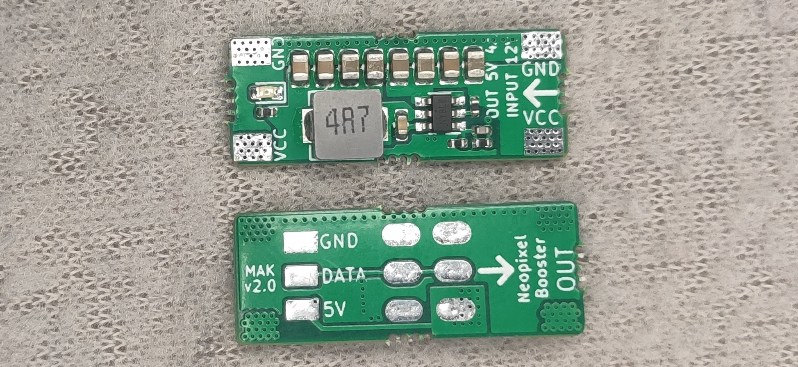

# RB0004 - Neopixel Booster

Probably all of us makers love WS2812B - the addressable LEDs, which are often
called "Neopixel" based on the brand created by
[Adafruit](https://learn.adafruit.com/adafruit-neopixel-uberguide). They are so
much fun to play with! Especially, when you can buy them in strips for less than
18 USD/5 meters!

These LEDs are, however, power hungry and the strips are not the best design.
Therefore you often struggle to power them - you need a 5V power supply with
large current rating. And these aren't easy to get. And if you get one, the
strips behave weirdly - the end of the strip have more reddish colors compared
to it's beginning.

**This is where RB0004 - Neopixel Booster comes in: it solves all the problems
above.**

View this project on [CADLAB.io](https://cadlab.io/project/23122).

## The Problem In Short

If you are interested in much in-depth explanation of the problem wit some
measurements, see the [page about strips properties](properties.md).

Each of the LEDs consumes around 60-70 mA in the full brightness (based on the
temperature and batch your have). Therefore, if you have 300 LEDs in a strip,
they will consume 18-21 A! That's a lot of current. When you push current though
a wire, there is voltage drop according to [Ohm's
law](https://en.wikipedia.org/wiki/Ohm%27s_law). The copper wire on the strips
is relatively thin and narrow, therefore, there will be a significant voltage
drop. It is quite common that you supply your strip with 5 V, but you will
measure only 2.5 V at the end of the strip. That means your LEDs can't shine the
full brightness.

But why they turn red? There are red, green and blue LED in the
chip. Each of the LED color have different [forward voltage
drop](https://en.wikipedia.org/wiki/LED_circuit) - the blue one has the larges
one and it is usually around 3 V. That means if you LED is supplied with less
than 3V, it cannot light up the blue channel and thus, it is missing from the
final color.

You could solve that with just bonding a thick wire the back of the strip.
However, a suitable wire for 21 A will be pretty thick (around 3.5 mm²).
Therefore, it is better to power the whole strip with with higher voltage, thus
lower the current flowing in the wires and only lower the voltage locally for a
few LEDs. And that's what exactly Neopixel Booster does.

You run an extra wire around your LED strip and connect multiple Neopixel
Boosters in the strip to power it by segments:

## Features

- **fixes the powering issue of the WS2812B LED strips on the market**
- you can power your strips with 6-18 V
    - higher voltage allows you to use thinner wires
    - when your power your strip with higher voltage, the power supply can have
      lower current rating.
    - you can easily use PC power supply for powering your LEDs.
    - you can easily power your strip from 2-4 Li-ion cells connected in series
- requires relatively easy modification the strip, see the [assembly
  guide](assembly.md)
- Neopixel Booster is step down module, see  [its characteristics and
  performance](https://roboticsbrno.github.io/RB0004-NeopixelBooster/eval_v2/index.html).

## I Want One!

## How Do I Use Them?

Once you buy a kit from us, follow the [assembly guide](assembly.md) and
within and hour you can have your boosted strips.

## How Many Do I Need Them?

We recommend to not exceed 60 LEDs per one Neopixel Booster. For convenient
assembly, it is best to put one Neopixel Booster for each 50 cm of the strip,
but if you want to go cheap, it is OK to apply it every meter.

## Licence

[RB0004 –
NeopixexlBooster](https://github.com/RoboticsBrno/RB0004-NeopixelBooster) by
[Jan Mrázek](https://honzamrazek.cz) and Martin Kousal is licensed under [CC
BY-NC-SA 4.0
](https://creativecommons.org/licenses/by-nc-sa/4.0).
